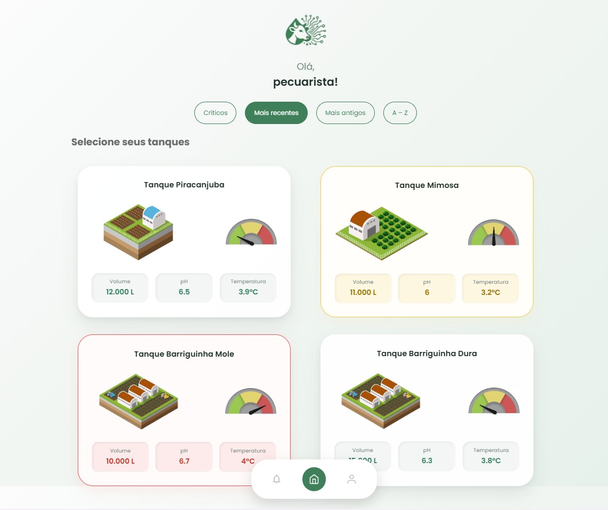

# Bezzer.IA (Aplicativo de Monitoramento de Tanques de Leite)
Este aplicativo (Android e iOS) oferece aos produtores de leite uma forma simples e prática de acompanhar, pelo celular, todos os parâmetros do tanque de resfriamento. A interface foi pensada para tornar o monitoramento mais acessível, permitindo visualizar indicadores onde quer que o produtor esteja.

---

## Sumário
- [Proposta de valor](#proposta-de-valor)
- [Público-alvo](#público-alvo)
- [Principais funcionalidades](#principais-funcionalidades)
- [Demonstração](#demonstração)
- [Identidade visual](#identidade-visual)
- [Tecnologias](#tecnologias)
- [Como rodar o projeto localmente](#como-rodar-o-projeto-localmente)

---

## Proposta de valor
O **Bezzer.IA** foi criado para transformar os dados do tanque em **decisão rápida no dia a dia do produtor**.

Na prática, ele permite:
- **Acompanhar o tanque em tempo real** direto do celular (sem depender de estar ao lado do equipamento);
- **Receber alertas por notificações** quando um parâmetro sai do esperado;
- **Consultar histórico** para identificar tendências e agir antes que uma variação vire prejuízo.

**Resultado:** mais controle, mais segurança operacional e mais tranquilidade na rotina da produção.

---

## Público-alvo
**Produtores de leite** que utilizam (ou desejam utilizar) um sistema de **monitoramento de tanque de resfriamento** e precisam de uma interface simples, acessível e prática no celular.

---

## Principais funcionalidades
- **Cadastro individual de usuário**
- **Dashboard do tanque (tempo real)**
  - Visualização direta de **Volume**, **pH** e **Temperatura (°C)**
- **Alertas por notificações**
  - Avisos quando parâmetros fogem do padrão (configuráveis conforme evolução do projeto)
- **Tela de histórico**
  - Visão **diária / mensal / anual** para acompanhar comportamento e tendências
- **Perfil e preferências**
  - Idiomas, segurança e ajustes do aplicativo

---

## Demonstração

Telas de Demonstração do App Bezzer.IA


<p align="center">
  
</p>

<p align="center">
  
  
  
  
</p>

As imagens acima são apenas screenshots do app para apresentar rapidamente a proposta e as telas principais.
Não significa que são as telas finais, pois estão em reprodução.


## Identidade visual
Cores sugeridas (paleta do produto):
- **Bege (base):** `#FBF9F3`
- **Verde (destaques):** `#3D8057`

---

## Tecnologias
Este repositório contém um **front-end em TypeScript** (SPA) com estrutura típica de projeto moderno (Vite), além de CSS e configurações de lint.

---

## Como rodar o projeto localmente

### Pré-requisitos
- **Node.js** (recomendado: versão LTS)
- **npm** (ou gerenciador compatível)

### Passo a passo
1. Clone o repositório:
   ```bash
   git clone https://github.com/bfd-front-endprojeto-integrador/Bezzer.IA.git
